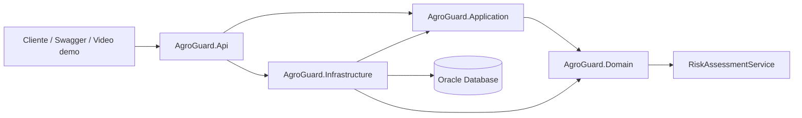
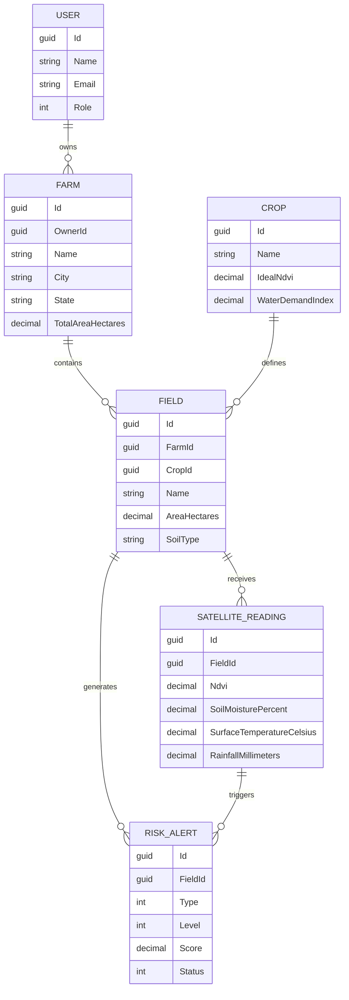
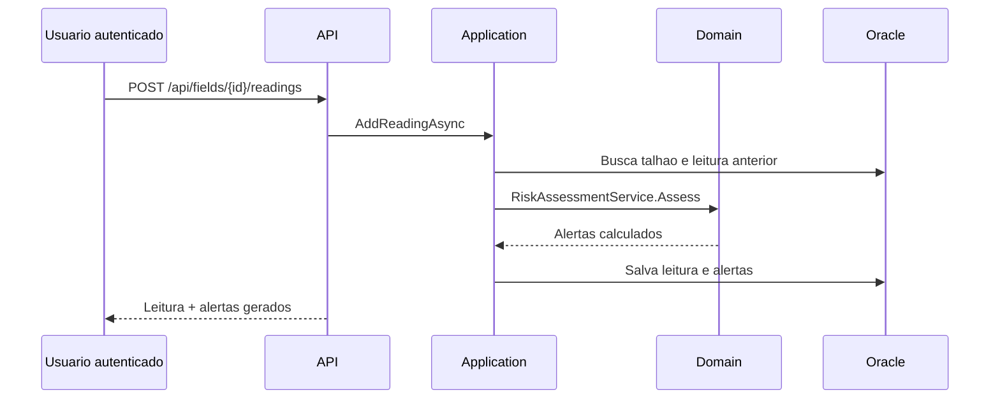
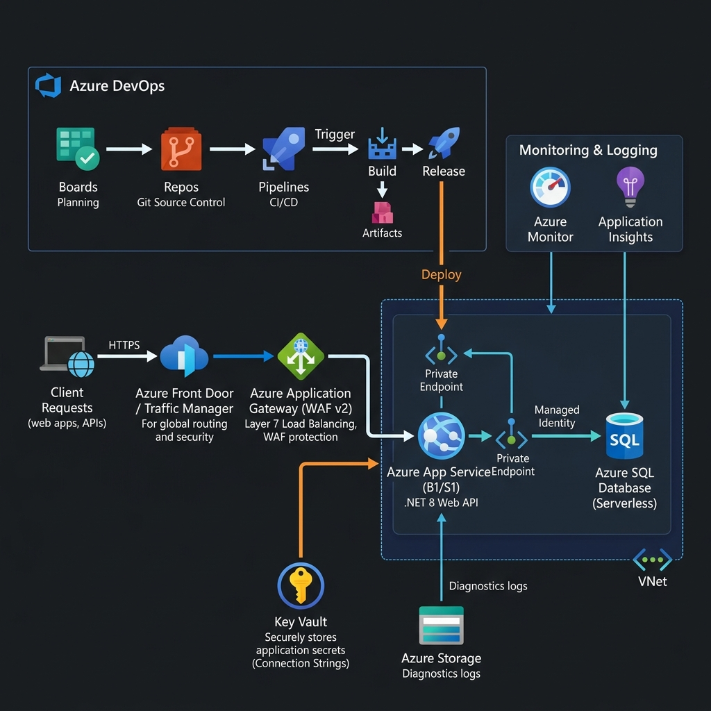

# AgroGuard Satellite API

API REST em ASP.NET Core para monitoramento agricola com leituras satelitais, estimativa de risco e alertas preventivos para propriedades rurais.

A proposta une agronegocio, dados espaciais e prevencao de desastres: produtores cadastram fazendas e talhoes, registram ou importam leituras de satelite como NDVI, umidade do solo, temperatura e chuva, e a API gera alertas de seca, incendio, enchente e queda de produtividade.

## Diferencial da solucao

O projeto integra a NASA POWER API para buscar dados agroclimaticos reais por latitude e longitude. A NASA fornece temperatura, precipitacao, umidade relativa, umidade do solo e cobertura de nuvens. Para completar a leitura agricola, o sistema estima o NDVI a partir do perfil da cultura e das condicoes climaticas recentes.

Tambem existe um catalogo de fazendas globais de demonstracao, com 28 areas agricolas em regioes como Brasil, Argentina, Estados Unidos, Canada, Europa, Africa, India, China, Sudeste Asiatico, Australia e Nova Zelandia. O usuario ainda pode cadastrar a propria fazenda e analisar seus talhoes com dados reais da NASA.

## Checklist dos requisitos

| Requisito | Onde esta implementado |
| --- | --- |
| API REST ASP.NET Core | `src/AgroGuard.Api` |
| Clean Architecture | `Domain`, `Application`, `Infrastructure`, `Api`, `Tests` |
| SOLID e DI | `DependencyInjection.cs` nas camadas Application e Infrastructure |
| Tratamento global de excecoes | `src/AgroGuard.Api/Middleware/ExceptionHandlingMiddleware.cs` |
| Banco relacional Oracle com EF Core | `AgroGuardDbContext` + `Oracle.EntityFrameworkCore` |
| Relacionamentos 1:N | usuario-fazendas, fazenda-talhoes, talhao-leituras, talhao-alertas |
| Migrations versionadas | `src/AgroGuard.Infrastructure/Persistence/Migrations` |
| JWT e rotas protegidas | `AuthController`, `JwtTokenService`, `[Authorize]` |
| Autorizacao por papel | criacao de culturas restrita a `Administrator` ou `Analyst` |
| Health checks | `/health` com API e Oracle DB |
| Swagger/OpenAPI | `/swagger` com suporte a Bearer JWT |
| Testes xUnit AAA | `tests/AgroGuard.UnitTests` |
| NASA POWER API | `src/AgroGuard.Infrastructure/Nasa/NasaPowerClient.cs` |

## Arquitetura



### Responsabilidades

| Camada | Responsabilidade |
| --- | --- |
| Domain | Entidades, enums e regras puras de avaliacao de risco |
| Application | Casos de uso, DTOs, contratos de repositorios e validacoes de fluxo |
| Infrastructure | EF Core Oracle, repositories, JWT, hash de senha e migrations |
| Api | Controllers, Swagger, JWT middleware, health checks e exceptions |
| Tests | Testes unitarios xUnit no padrao Arrange, Act, Assert |

## Modelo de dominio



## Fluxo principal



## Stack tecnica

- .NET 8 LTS
- ASP.NET Core Web API
- Entity Framework Core 8
- Oracle.EntityFrameworkCore
- JWT Bearer Authentication
- Swagger/OpenAPI
- Health Checks
- xUnit
- Docker Compose para Oracle Free

## Como executar

### 1. Restaurar dependencias

```powershell
dotnet restore AgroGuard.sln
dotnet tool restore
```

### 2. Subir Oracle local

```powershell
docker compose up -d oracle
```

A connection string padrao esta em `src/AgroGuard.Api/appsettings.json`:

```txt
User Id=AGROGUARD;Password=AgroGuard123;Data Source=localhost:1521/FREEPDB1;
```

### 3. Aplicar migrations

```powershell
dotnet tool run dotnet-ef database update --project src/AgroGuard.Infrastructure/AgroGuard.Infrastructure.csproj --startup-project src/AgroGuard.Api/AgroGuard.Api.csproj --context AgroGuardDbContext
```

### 4. Rodar a API

```powershell
dotnet run --project src/AgroGuard.Api/AgroGuard.Api.csproj
```

Depois acesse:

- Interface web: `http://localhost:5218`
- Swagger: `http://localhost:5218/swagger`
- Health check: `http://localhost:5218/health`

## Endpoints principais

| Metodo | Rota | Protecao | Uso |
| --- | --- | --- | --- |
| POST | `/api/auth/register` | Publica | Cria usuario produtor |
| POST | `/api/auth/login` | Publica | Retorna JWT |
| GET | `/api/crops` | JWT | Lista culturas com parametros agronomicos |
| POST | `/api/crops` | JWT + Analyst/Admin | Cria cultura monitorada |
| GET | `/api/farms` | JWT | Lista fazendas do usuario |
| POST | `/api/farms` | JWT | Cadastra fazenda |
| GET | `/api/fields/farm/{farmId}` | JWT | Lista talhoes da fazenda |
| POST | `/api/fields` | JWT | Cadastra talhao |
| POST | `/api/fields/{id}/readings` | JWT | Insere leitura satelital e gera alertas |
| GET | `/api/nasa/global-farms` | JWT | Analisa fazendas globais com dados NASA |
| POST | `/api/nasa/coordinates/analyze` | JWT | Analisa qualquer coordenada selecionada no mapa |
| POST | `/api/nasa/fields/{fieldId}/analyze` | JWT | Gera leitura NASA para um talhao do usuario |
| GET | `/api/alerts` | JWT | Lista alertas |
| GET | `/api/alerts/high-risk` | JWT | Lista alertas altos e criticos |
| PATCH | `/api/alerts/{id}/resolve` | JWT | Resolve alerta |
| GET | `/api/dashboard/summary` | JWT | Retorna resumo operacional |
| GET | `/health` | Publica | Verifica API e Oracle |

## Interface web

A API tambem serve uma interface visual em:

```txt
http://localhost:5218
```

A interface usa os endpoints reais da API:

- login e cadastro com JWT;
- mapa interativo com Leaflet/OpenStreetMap para selecionar fazendas ou coordenadas;
- fazendas globais analisadas com dados reais da NASA;
- analise de qualquer coordenada escolhida pelo usuario;
- exibicao de indicadores agroclimaticos, NDVI estimado e alertas;
- painel de health checks.

Os endpoints de fazendas, talhoes e leituras continuam no backend para cumprir os requisitos tecnicos de relacionamento, persistencia Oracle e arquitetura REST, mas a experiencia principal da entrega foi concentrada no modulo Mundo NASA.

O Swagger continua disponivel em:

```txt
http://localhost:5218/swagger
```

## Exemplo de uso

### Registrar usuario

```http
POST /api/auth/register
Content-Type: application/json

{
  "name": "Produtor Demo",
  "email": "produtor@agroguard.com",
  "password": "AgroGuard123"
}
```

### Criar fazenda

```http
POST /api/farms
Authorization: Bearer {token}
Content-Type: application/json

{
  "name": "Fazenda Horizonte Verde",
  "city": "Ribeirao Preto",
  "state": "SP",
  "latitude": -21.1775,
  "longitude": -47.8103,
  "totalAreaHectares": 1240.50
}
```

### Enviar leitura satelital

```http
POST /api/fields/{fieldId}/readings
Authorization: Bearer {token}
Content-Type: application/json

{
  "capturedAt": "2026-06-06T12:00:00Z",
  "source": "Sentinel-2 Academic Sample",
  "ndvi": 0.42,
  "soilMoisturePercent": 18,
  "surfaceTemperatureCelsius": 39,
  "rainfallMillimeters": 0,
  "cloudCoveragePercent": 12
}
```

Resposta esperada: a API salva a leitura e retorna alertas como seca, incendio ou queda de produtividade, com score, nivel de risco, descricao e recomendacao.

## Integracao NASA POWER

A integracao esta em:

```txt
src/AgroGuard.Infrastructure/Nasa/NasaPowerClient.cs
```

Parametros consumidos:

| Parametro | Uso no AgroGuard |
| --- | --- |
| `T2M` | Temperatura media |
| `T2M_MAX` | Temperatura maxima para risco de calor/incendio |
| `PRECTOTCORR` | Chuva acumulada para seca ou enchente |
| `RH2M` | Umidade relativa |
| `GWETROOT` | Umidade do solo na zona de raiz |
| `GWETTOP` | Umidade do solo superficial |
| `CLOUD_AMT` | Cobertura de nuvens |

Como a NASA POWER nao entrega NDVI diretamente nesse endpoint, o projeto calcula um NDVI estimado para a demonstracao com base no NDVI ideal da cultura, umidade do solo, calor extremo e chuva recente.

Fontes oficiais usadas:

- NASA POWER Daily API: `https://power.larc.nasa.gov/docs/services/api/temporal/daily/`
- NASA POWER Parameter Dictionary: `https://power.larc.nasa.gov/parameters/`

## Mapa e dados de fazendas

A interface usa Leaflet com OpenStreetMap, porque funciona sem chave paga e sem conta de billing. O Google Maps tambem poderia ser usado, mas a Maps JavaScript API exige API key e billing habilitado.

O projeto usa tres fontes/estrategias:

| Origem | Uso no projeto | Observacao |
| --- | --- | --- |
| Fazendas globais de demonstracao | 28 marcadores pre-carregados no mapa | Criadas para demo academica com coordenadas reais de regioes agricolas |
| Clique livre no mapa | Analise imediata de qualquer latitude/longitude | Usa NASA POWER em tempo real |
| Fazendas do usuario | Cadastro proprio + analise NASA do talhao | Persiste no Oracle |

Nao existe uma API global, gratuita e padronizada que entregue todos os talhoes/fazendas do mundo com limites, dono e cultura. Algumas fontes ajudam parcialmente:

- OpenStreetMap/Overpass pode retornar areas `landuse=farmland` ou `landuse=farmyard`, mas a cobertura varia por regiao e normalmente nao traz cultura ou produtor.
- No Brasil, dados publicos do CAR/SICAR podem trazer poligonos de imoveis rurais, mas nao necessariamente talhoes produtivos ou cultura plantada.
- Nos EUA, dados de Common Land Unit existem, mas nao sao totalmente publicos.

## Regra de risco

A regra principal esta em `RiskAssessmentService` e considera:

- NDVI atual comparado com o NDVI ideal da cultura;
- umidade do solo;
- temperatura de superficie;
- chuva acumulada;
- cobertura de nuvens;
- queda de NDVI em relacao a leitura anterior;
- demanda hidrica da cultura.

Os alertas usam quatro niveis:

- `Low`
- `Moderate`
- `High`
- `Critical`

A API persiste apenas alertas com score relevante, a partir de risco moderado.

## Testes automatizados

Executar:

```powershell
dotnet test AgroGuard.sln
```

Testes implementados:

- gera alerta de seca quando ha estresse hidrico;
- gera alerta de enchente quando ha solo saturado e chuva alta;
- gera alerta de queda produtiva quando o NDVI cai bruscamente;
- nao gera alerta em leitura saudavel;
- resolve alerta aberto corretamente.

Todos seguem o padrao AAA:

```csharp
// Arrange
// Act
// Assert
```

## Migrations

As migrations estao versionadas em:

```txt
src/AgroGuard.Infrastructure/Persistence/Migrations
```

Comando para criar nova migration:

```
powershell
```

cd GS.Net

docker compose up -d oracle

dotnet tool restore

dotnet tool run dotnet-ef database update --project src\AgroGuard.Infrastructure\AgroGuard.Infrastructure.csproj --startup-project src\AgroGuard.Api\AgroGuard.Api.csproj --context AgroGuardDbContext

dotnet run --project src\AgroGuard.Api\AgroGuard.Api.csproj --urls http://localhost:5218


## DevOps & Cloud (Azure DevOps & Azure CLI)

Esta seção documenta a infraestrutura em nuvem, a pipeline de CI/CD e as políticas de controle de código implementadas no Azure DevOps para a Global Solution.

### 1. Desenho Macro da Arquitetura

O diagrama abaixo ilustra o fluxo de dados desde a requisição do cliente até os recursos em nuvem no Azure, bem como a esteira de integração e entrega contínuas:



**Fluxo de Funcionamento:**
1. O desenvolvedor realiza commits e cria Pull Requests vinculados às tarefas do **Azure Boards**.
2. Após aprovação e merge da PR na branch `main`, a pipeline de CI (**Azure Pipelines**) compila a API .NET 8, roda os testes unitários (xUnit) e publica o artefato `drop` (ZIP).
3. A pipeline de CD (**Release**) é disparada pelo novo artefato e realiza o deploy no **Azure App Service**.
4. O **Azure App Service** se comunica de forma segura com o container do **Oracle Database (ACI)** usando variáveis de ambiente configuradas para a string de conexão.

---

### 2. Provisionamento via Azure CLI (Infraestrutura como Código)

Os scripts de infraestrutura e banco estão na pasta `/scripts`:
* **`script-infra.sh`**: Cria o Resource Group (`rg-agroguard-gs`), o banco de dados Oracle no Azure Container Instances (ACI), o plano do App Service (Linux) e o Web App (.NET 8). Adiciona a connection string segura (`Oracle`) e as configurações de JWT nas App Settings do Web App.
* **`script-bd.sql`**: Contém o DDL completo de todas as tabelas (`AG_USERS`, `AG_CROPS`, `AG_FARMS`, `AG_FIELDS`, `AG_SATELLITE_READINGS`, `AG_RISK_ALERTS`), chaves primárias, estrangeiras, índices e dados iniciais de semente.

Para executar o script de infraestrutura localmente:
```bash
chmod +x scripts/script-infra.sh
./scripts/script-infra.sh
```

---

### 3. Configuração do Azure DevOps

#### 3.1. Políticas de Branch Protection (Branch `main`)
Para proteger o código em produção, a branch `main` foi configurada com as seguintes políticas:
1. **Revisores Obrigatórios**: Mínimo de 1 revisor para aprovar Pull Requests.
2. **Vinculação de Work Items**: Exige que commits/PRs estejam vinculados a um card do Azure Boards.
3. **Revisores Padrão**: Inclusão automática do revisor padrão (RM do aluno/Professor).
4. **Simulação de Auto-Aprovação**: Permissão ativada temporariamente para o criador do PR aprovar sua própria alteração para fins acadêmicos.

#### 3.2. Azure Pipelines (Build - CI)
O arquivo `azure-pipeline.yml` está na raiz e executa:
1. Instalação do SDK do .NET 8.
2. `dotnet restore` de todas as dependências.
3. `dotnet build` em modo Release.
4. `dotnet test` (execução e publicação dos resultados dos testes unitários xUnit).
5. `dotnet publish` gerando o ZIP do Web App.
6. Publicação do artefato `drop`.

#### 3.3. Azure Release Pipelines (Deploy - CD)
A release pipeline deve ser criada de forma visual no portal do Azure DevOps com:
* **Trigger de Artefato**: Habilitado para disparar automaticamente a cada build bem-sucedido na branch `main`.
* **Stage de Deploy**: Uma tarefa do tipo `Azure Web App Deploy` configurada para implantar o pacote ZIP no Web App criado.

---

### 4. Exemplos Completos de CRUD (JSON)

Caso não utilize a interface Swagger interativa, os payloads para testar os endpoints de CRUD são os seguintes:

#### 4.1. Criar Usuário (POST /api/auth/register)
```json
{
  "name": "Agricultor GS",
  "email": "agricultor.gs@agroguard.com",
  "password": "AgroGuard123Password"
}
```

#### 4.2. Login (POST /api/auth/login)
```json
{
  "email": "agricultor.gs@agroguard.com",
  "password": "AgroGuard123Password"
}
```

#### 4.3. Cadastrar Fazenda (POST /api/farms)
*Requer JWT no Header: `Authorization: Bearer {token}`*
```json
{
  "name": "Fazenda Agro Guard",
  "city": "Campinas",
  "state": "SP",
  "latitude": -22.9064,
  "longitude": -47.0616,
  "totalAreaHectares": 850.75
}
```

#### 4.4. Cadastrar Talhão (POST /api/fields)
*Requer JWT no Header. ID da Cultura de Soja do Seed: `11111111-1111-1111-1111-111111111111`*
```json
{
  "farmId": "ID_DA_FAZENDA_RETORNADO_NO_PASSO_4.3",
  "cropId": "11111111-1111-1111-1111-111111111111",
  "name": "Talhão A1 - Soja",
  "areaHectares": 120.50,
  "latitude": -22.9070,
  "longitude": -47.0620,
  "soilType": "Argiloso",
  "plantedAt": "2026-06-01T08:00:00Z",
  "expectedHarvestAt": "2026-10-15T18:00:00Z"
}
```

#### 4.5. Enviar Leitura Satelital (POST /api/fields/{id}/readings)
*Substituir `{id}` pelo ID do Talhão. Requer JWT.*
```json
{
  "capturedAt": "2026-06-08T12:00:00Z",
  "source": "Sentinel-2 Satellite",
  "ndvi": 0.380,
  "soilMoisturePercent": 15.50,
  "surfaceTemperatureCelsius": 38.00,
  "rainfallMillimeters": 0.00,
  "cloudCoveragePercent": 5.00
}
```
*Resposta: Retorna a leitura salva e uma lista de alertas de risco estimados (como seca ou incêndio).*

#### 4.6. Listar Alertas (GET /api/alerts)
*Requer JWT no Header. Retorna todos os alertas gerados.*

#### 4.7. Resolver Alerta (PATCH /api/alerts/{id}/resolve)
*Substituir `{id}` pelo ID do Alerta. Requer JWT no Header.*
```json
{}
```

